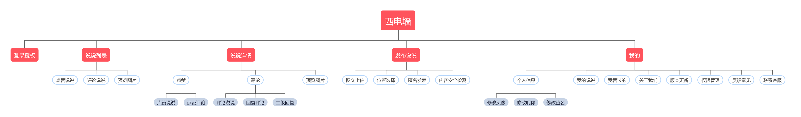

# 云开发竞赛作品-TFA-西电墙
## 1.作品简介
西电有三大QQ公众号，分别是西电表白墙、西电小喇叭和西电撕逼墙，分别用于满足学生表白（情感诉求）、寻物找人租房（生活帮助）还有吐槽（压力宣泄）的需求。
这三大QQ公众号具有相同的运作模式：用户将信息发送给指定的QQ账号，负责接洽的人（类似客服）将发过来的消息直接截图，之后将多个截图合并发布一条说说，因此在这三大公众号的动态下，几乎全是图片九宫格的形式。
这种形式其实并不利于大段文本信息的展示，尽管采用上述的运作方式对于他们来说无遗是低成本高效的。但是我们还是决定开发这样一个小程序，将以上三者的功能合并，用户可以直接发表自己的想法，无需转发给相关账号再转变为截图的形式，直接支持发布文本和图片，同时支持匿名发表以保护用户隐私。

## 2.实现思路/架构图/流程图

### 小程序功能结构

## 3.项目效果图例

## 4.源码链接

https://github.com/15029035790/XidianWall
